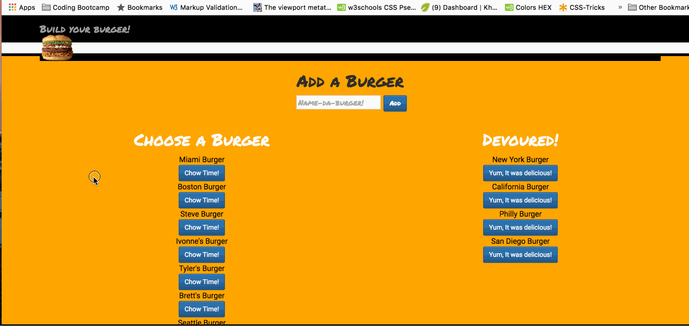

burger

# Eat-Da-Burger!
This is a burger app with a restaurant website twist to it. 

It uses HTML, CSS, Bootstrap, JavaScript, npm express, node, handlebars and MySQL database.  
This is a an app that let's the user add a burger. Has options to add a burger or devour an existing one. The burgers that are devoured(eaten) are moved from the left side of the screen to the column on the right side.. The app stores every burger in a database whether devoured or not.

## What it looks like:

## Technologies Used: 
- HTML
- CSS
- Bootstrap (Carousel used to display images of burgers)
- jQuery
- mySQL
- JavaScript 
- node.js 
- npm packages used: 
**express-handlebars** used for ... 
**method-override** used for ... 
**body-parser** used to parse ... 
**mySQL** database  

## Built With:
* Sublime Text

## Links: 	
- https://ivonnek.github.io/burger/ 
- https://github.com/IvonneK/burger/

## Author: 
**Ivonne Komis** 
Member: Rutgers Coding Bootcamp
